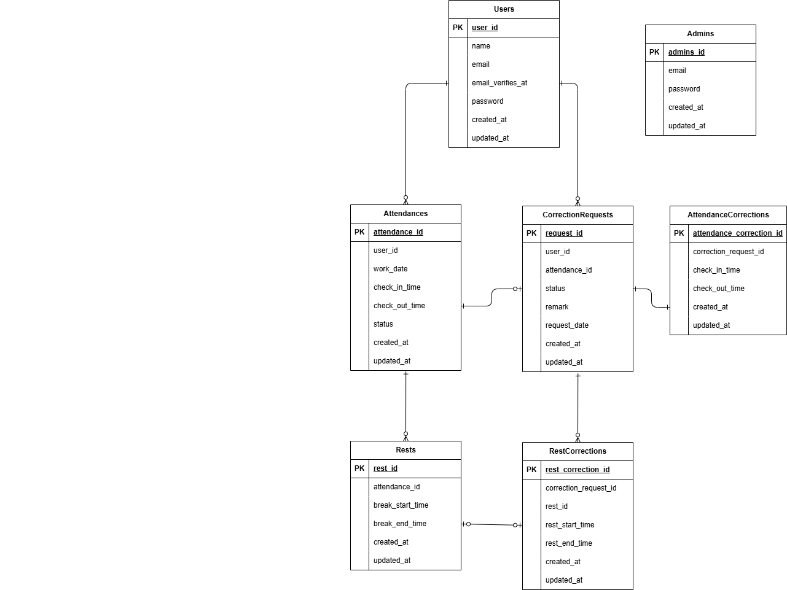

# 新模擬案件_勤怠管理アプリ
  
## プロジェクト概要
- サービス名  
    coachtech勤怠管理アプリ
- サービス概要  
    ある企業が開発した独自の勤怠管理アプリ
- 制作の背景と目的  
    ユーザーの勤怠と管理を目的とする
- 制作の目標  
    初年度でのユーザー数1000人達成
- ターゲットユーザー  
    社会人全般
- ターゲットブラウザ・OS  
    PC：Chrome/Firefox/Safari 最新バージョン
- 開発手法  
    開発言語：PHP  
    フレームワーク：Laravel  
    バージョン管理：Docker, GitHub  
  
## 環境構築
- Dockerビルド  
    ・`git clone git@github.com:misaki-nonaka/mock-case-2.git`  
    ・`docker-compose up -d --build`  

- Laravel環境構築  
    ・`cp src/.env.example src/.env`　、適宜環境変数変更  
    ・`docker-compose exec php bash`  
    ・`composer install`  
    ・`php artisan key:generate`  
    ・`php artisan migrate`  
    ・`php artisan db:seed`  
  
- 開発環境  
    ・ログイン画面(一般)：http://localhost/login  
    ・勤怠登録画面(一般)：http://localhost/attendance  
    ・ログイン画面(管理者)：http://localhost/admin/login  
    ・勤怠一覧画面(管理者)：http://localhost/admin/attendance/list  
    ・phpMyAdmin：http://localhost:8080/  
  
- ユーザーログイン情報  
    ・管理者  
    　email：admin1@sample.com  
    　password：password  
  
    ・一般ユーザー(ここには3名分のみ記載)  
    　氏名：西伶奈  
    　email：reina.nishi@coachtech.com  
    　password：password  
  
    　氏名：山田太郎  
    　email：taro.yamada@coachtech.com  
    　password：password  
  
    　氏名：増田一世  
    　email：issei.masuda@coachtech.com  
    　password：password  
  
## 使用技術(実行環境)
・PHP 8.1.34  
・Laravel 8.83.8  
・MySQL 8.0.26  
・nginx 1.21.1  
・phpMyAdmin 5.2.3  
・mailhog 1.0.1  
  
## テスト方法
- テスト環境設定  
・`cp src/.env.testing.example src/.env.testing`  
・`docker-compose exec php bash`  
・`php artisan key:generate --env=testing`  
・`php artisan config:clear`  
・`php artisan migrate --env=testing`  
- テスト実行  
・`php artisan test`  
  
## ER図
  
  
  
## 機能要件について
機能要件に明記されていない機能について、コーチと相談の上、以下のように実装しています。
- 「認証はこちらから」のボタンを押すと、Mailhog受信箱へ遷移する
- 勤怠詳細画面では、承認待ち状態の時は修正前のデータが表示される
- 管理者による勤怠の直接修正は、何回でも修正可能
- 申請一覧画面は一般ユーザーと管理者で同じルートが設定されていますが、コントローラー上で権限の違いにより、取得するデータを条件分けしています。
- 勤怠詳細画面で、修正申請が承認済みとなった場合、「*修正が承認済みのため変更できません。」と表示する。
